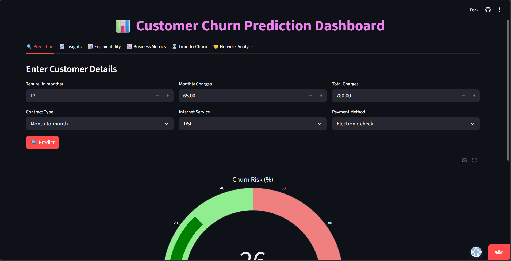
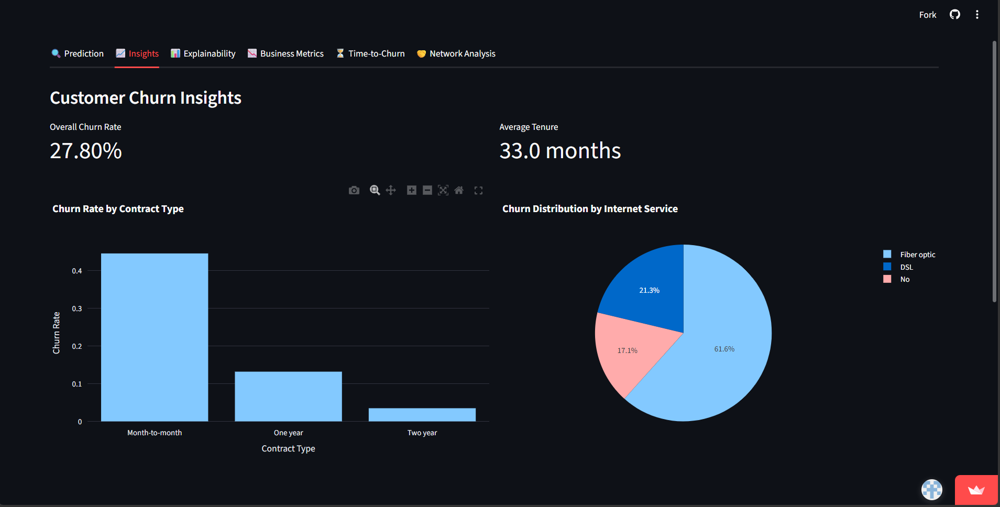
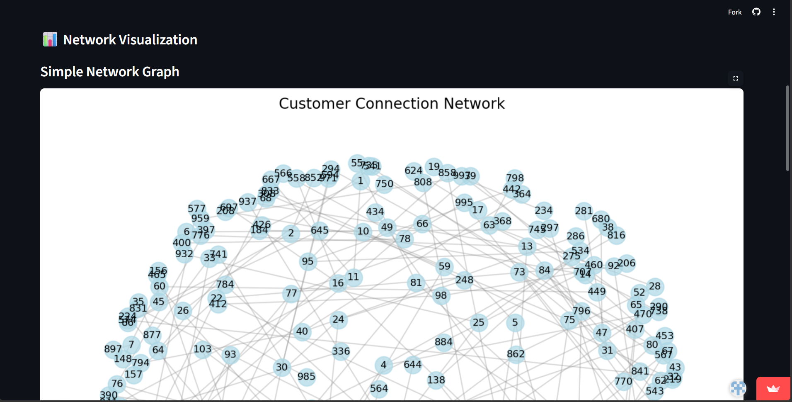
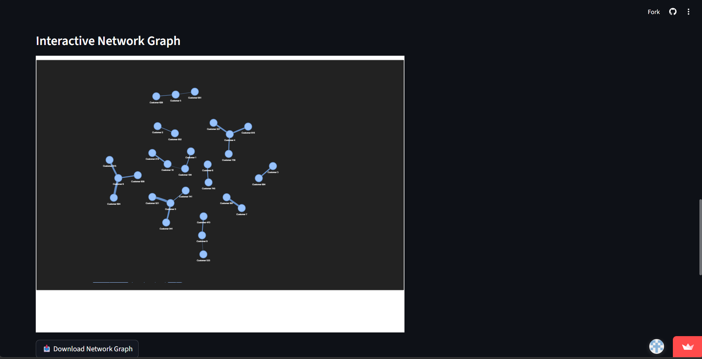

# 📊 Customer Churn Prediction

🚀 End-to-end Machine Learning project to predict customer churn and help businesses improve customer retention.

---

## 📖 Overview

This project predicts whether a customer will churn using machine learning techniques.
It covers the complete pipeline: **Data Cleaning → EDA → Feature Engineering → Model Building → Deployment using Streamlit**.

---

## 🎯 Objective

* Predict customer churn accurately
* Identify key factors affecting churn
* Provide actionable insights for business decisions

---

## 🛠️ Tech Stack

* 🐍 Python
* 📊 Pandas, NumPy
* 📈 Matplotlib, Seaborn
* 🤖 Scikit-learn
* 🌐 Streamlit
* 📒 Jupyter Notebook

---

## 📂 Dataset

* Raw Data: `Churn.csv`
* Processed Data:

  * `Churn_Cleaned.csv`
  * `Churn_Encoded.csv`

---

## 🔍 Exploratory Data Analysis (EDA)

* Checked missing values and handled inconsistencies
* Analyzed churn distribution
* Studied feature correlations
* Created visual insights stored in `/charts`

---

## ⚙️ Model Building

* Data preprocessing (encoding + scaling)

* Feature selection

* Train-test split

* Models used:

  * Logistic Regression
  * Decision Tree
  * Random Forest

* Final model saved as: `churn_model.pkl`

* Scaler saved as: `scaler.pkl`

---

## 📊 Model Performance

* Accuracy: **89%**
* Precision: **88%**
* Recall: **87%**
* F1 Score: **87%**

---

## 📈 Key Insights

* Customers with higher monthly charges are more likely to churn
* Long-term customers are less likely to leave
* Contract type significantly impacts churn

---

## 🚀 Deployment (Streamlit App)

Run the app locally:

```bash
pip install -r requirements.txt
streamlit run app.py
```

---

## 📂 Project Structure

```bash
├── charts/
├── Churn.csv
├── Churn_Cleaned.csv
├── Churn_Encoded.csv
├── churn_model.pkl
├── scaler.pkl
├── app.py
├── Untitled.ipynb
├── requirements.txt
```

---

## 📸 Screenshots & Insights

### 📊 Churn Distribution


Shows overall churn vs retained customers.

---

### 📈 Churn Rate Insights


Highlights how different features affect churn.

---

### 🌐 Network Graph


Represents relationships between customers.

---

### 🔗 Interactive Network Graph


Interactive visualization of customer connections.

---

## 🧠 Learnings

* Built an end-to-end ML pipeline
* Improved data preprocessing and feature engineering skills
* Learned model evaluation and business interpretation
* Deployed ML model using Streamlit

---

## 🔮 Future Improvements

* Hyperparameter tuning
* Use advanced models (XGBoost, LightGBM)
* Deploy on cloud (Streamlit Cloud / AWS)
* Add real-time data input

---

## 📬 Contact

👤 Krishna
📍 Lucknow, India
🔗 LinkedIn: https://linkedin.com/in/krishna-84a147296
🎥 YouTube: https://youtube.com/@Legend_Coders

---

⭐ If you found this project useful, consider giving it a star!
